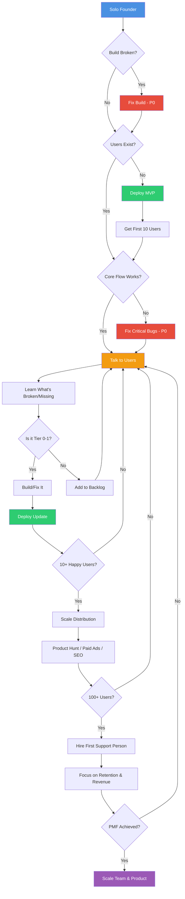

# Solo Founder Playbook - ResumeBuilder AI

**Version**: 1.0
**Last Updated**: 2025-12-12
**Status**: PRE-LAUNCH (Build Broken)

This document is the single source of truth for building, shipping, and managing ResumeBuilder AI as a solo founder. It acts as the decision gate for all product, technical, and marketing priorities.

---

## Current Stage Assessment

### Product Stage: FEATURE-COMPLETE MVP (UNVALIDATED)

- Core features built: resume upload, AI optimization, ATS scoring, chat refinement, templates, export
- Phase 7 (Enhanced AI Assistant) implemented
- Applications tracking system exists
- Design customization with undo/revert capability
- NO ACTIVE USERS - product is unvalidated by market

### Technical Stage: CRITICAL BUGS BLOCKING LAUNCH

**Build Status**: WORKING (static export disabled; server render)
**Test Status**: PARTIAL (thread-manager fixed; full suite not run)
**Database Status**: SCHEMA WARNINGS PRESENT
**Deployment Status**: NOT PRODUCTION-READY

### Market Stage: PRE-LAUNCH

- No user acquisition started
- No validation of product-market fit
- Freemium model defined but not tested
- Stripe integration status unknown

---

## What "Progress" Means Right Now

At this stage, progress = moving toward first paying user. Specifically:

1. Build completes without errors
2. All core user flows work end-to-end
3. Database is stable and secure
4. Product deployed to production
5. First 10 users can sign up and complete optimization without your help
6. Payment flow works for premium upgrade

Any work that does not directly contribute to these outcomes is distraction.

---

## What "Done" vs "In Progress" vs "Blocked" Means

### DONE
- Feature works in production
- Tests pass
- No known bugs in the flow
- User can complete action without manual intervention
- Change is deployed

### IN PROGRESS
- Actively working on it today
- Code written but not tested
- Tests exist but failing
- Deployed but has minor bugs

### BLOCKED
- Cannot proceed without external input
- Depends on another task not yet done
- Waiting on third-party (Stripe, OpenAI API access, etc.)
- Technical blocker (build broken, dependencies conflicted)

---

## Founder Control Dashboard

### Critical Blockers (MUST FIX BEFORE LAUNCH)

| Issue | Status | Impact | Location |
|-------|--------|--------|----------|
| Build fails with Html import error | DONE | Cannot deploy | Template system, prebuild step |
| Tests failing (thread-manager) | DONE | Unknown stability | tests/lib/ai-assistant/thread-manager.test.ts |
| Database schema warnings | IN PROGRESS | Security/performance risk | See migration 20251210_check_all_warnings.sql |
| Template sync disabled | BLOCKED | Users cannot use templates | prebuild script disabled |
| Rate limiting removed/changed | DONE | Potential API cost explosion | src/lib/utils/rate-limit.ts deleted |

### Core User Flows (End-to-End Validation)

| Flow | Status | Last Verified | Blocker |
|------|--------|---------------|---------|
| Sign up → Email verification | UNKNOWN | Never | Need to test |
| Upload resume (PDF) | UNKNOWN | Never | Build broken |
| Paste job description | UNKNOWN | Never | Build broken |
| Generate optimization | UNKNOWN | Never | Build broken |
| View ATS score | UNKNOWN | Never | Build broken |
| Chat refinement | UNKNOWN | Never | Build broken |
| Apply template | BLOCKED | Never | Template sync disabled |
| Export PDF | UNKNOWN | Never | Build broken |
| Upgrade to premium | UNKNOWN | Never | Stripe integration unverified |

### Technical Debt & Bugs

| Category | Count | Priority | Next Action |
|----------|-------|----------|-------------|
| Build errors | 1 | P0 | Fix Html import in templates |
| Failing tests | 1+ | P0 | Fix Supabase mock in thread-manager test |
| Database warnings | Unknown | P1 | Run 20251210_check_all_warnings.sql and triage |
| Disabled features | 1 | P1 | Fix template sync or remove feature |
| Security issues (RLS) | Unknown | P0 | Verify all tables have RLS policies |
| Performance issues | Unknown | P2 | Check for missing indexes |

### Feature Readiness

| Feature | Built | Tested | Documented | Production-Ready |
|---------|-------|--------|------------|------------------|
| Resume Upload (PDF/DOCX) | YES | NO | YES | NO |
| Job Description Input | YES | NO | YES | NO |
| AI Optimization | YES | NO | YES | NO |
| ATS Scoring | YES | NO | YES | NO |
| Chat Refinement | YES | NO | YES | NO |
| Template System | PARTIAL | NO | YES | NO |
| PDF Export | YES | NO | YES | NO |
| Applications Tracking | YES | NO | NO | NO |
| Design Customization | YES | NO | YES | NO |
| Freemium Limits | YES | NO | NO | NO |
| Stripe Payments | UNKNOWN | NO | NO | NO |

### User Feedback & Validation

| Metric | Current | Target | Status |
|--------|---------|--------|--------|
| Total Users | 0 | 10 | Not started |
| Active Users (7d) | 0 | 5 | Not started |
| Optimizations Created | 0 | 20 | Not started |
| Premium Conversions | 0 | 1 | Not started |
| User Interviews | 0 | 5 | Not started |
| NPS Score | N/A | 40+ | Not started |

### Marketing & Distribution Readiness

| Channel | Status | Next Action | Timeline |
|---------|--------|-------------|----------|
| Landing Page | EXISTS | Verify messaging after user testing | After launch |
| SEO Foundation | UNKNOWN | Check meta tags, sitemap | Before launch |
| Product Hunt Launch | NOT STARTED | Not ready yet | After 10 users |
| Social Media Presence | UNKNOWN | Not a priority | Post-validation |
| Email Collection | UNKNOWN | Verify works | Before launch |
| Analytics | UNKNOWN | Install PostHog/Mixpanel | Before launch |

### Risks & Unknowns

| Risk | Likelihood | Impact | Mitigation |
|------|------------|--------|------------|
| Build cannot be fixed easily | MEDIUM | CRITICAL | Investigate Html import issue today |
| OpenAI API costs too high | HIGH | HIGH | Verify rate limiting exists and works |
| Users don't understand value prop | HIGH | CRITICAL | User interviews before broad launch |
| ATS scoring is inaccurate | MEDIUM | HIGH | Test against known resume/JD pairs |
| Payment flow broken | MEDIUM | HIGH | Test Stripe integration end-to-end |
| Database performance at scale | LOW | MEDIUM | Check indexes from migration warnings |
| Competitor launches similar product | MEDIUM | MEDIUM | Speed to market - ship fast |

### Decisions Pending

| Decision | Options | Deadline | Owner |
|----------|---------|----------|-------|
| Fix templates or remove feature? | Fix / Remove / Simplify | This week | You |
| Launch with broken templates? | Yes / No | Before launch decision | You |
| What is minimum viable launch state? | Define criteria | Today | You |
| Free tier: 1 or 3 optimizations? | 1 / 3 / 5 | Before launch | You |
| How to validate ATS scoring accuracy? | Manual test / User feedback / Both | This week | You |
| Deploy to Vercel or other? | Vercel / Railway / Other | This week | You |

---

## Immediate Next Steps (Next 7 Days)

### Priority 0: Unblock Deployment (Days 1-3)

1. **Fix build error** (Html import issue) — **DONE**
   - Location: Template system causing prebuild failure
   - Action: Disabled static export, forced dynamic rendering; build now passes
   - Success: `npm run build` completes successfully
   - Time estimate: 4 hours

2. **Fix failing tests** — **PARTIAL**
   - Location: tests/lib/ai-assistant/thread-manager.test.ts
   - Action: Fixed Supabase mock paths and injectable OpenAI client; this test now passes. Full suite not yet run.
   - Success target: `npm run test` exits with 0 errors
   - Time estimate: 2 hours

3. **Run database health check** — **PENDING**
   - Location: supabase/migrations/20251210_check_all_warnings.sql
   - Action: Execute in Supabase SQL Editor, triage all warnings
   - Success: Document all issues, create fix plan for P0/P1 items
   - Time estimate: 2 hours

4. **Verify rate limiting exists** — **DONE**
   - Location: Rate limit middleware/utilities
   - Action: Re-enabled limits on /api/optimize and /api/v1/chat using in-memory rate limiter; returns 429 with headers
   - Success: Rate limiting active on AI endpoints
   - Time estimate: 1 hour

### Updated Next Steps (P0/P1)
- Run full Jest suite to surface remaining failures; fix any blockers.
- Execute `20251210_check_all_warnings.sql` in Supabase, list warnings, and create fixes for P0/P1 items.
- Decide on template sync path (fix or temporarily disable feature) to remove remaining BLOCKER.
- Add outputFileTracingRoot or remove extra lockfiles to silence Next.js root warning before deploy.

### Priority 1: Validate Core Flows (Days 4-5)

5. **Manual end-to-end testing**
   - Action: Test every core flow as a user would
   - Flows: Sign up → Upload → Paste JD → Optimize → Score → Export
   - Success: Document working flows and broken flows
   - Time estimate: 4 hours

6. **Fix critical flow blockers**
   - Action: Fix any P0 bugs discovered in testing
   - Success: User can complete upload → optimize → export without errors
   - Time estimate: 6 hours

7. **Verify Stripe integration**
   - Action: Test upgrade flow, verify webhook handling
   - Success: Can upgrade to premium and unlock features
   - Time estimate: 3 hours

### Priority 2: Deploy (Days 6-7)

8. **Set up production environment**
   - Action: Configure Vercel project, environment variables, domain
   - Success: App accessible at production URL
   - Time estimate: 2 hours

9. **Deploy and smoke test**
   - Action: Deploy to production, test core flows in prod
   - Success: All core flows work in production
   - Time estimate: 2 hours

10. **Install basic analytics**
    - Action: Add PostHog or Mixpanel
    - Track: Signups, optimizations created, exports, upgrades
    - Success: Events flowing to analytics dashboard
    - Time estimate: 2 hours

**Total estimated time: 28 hours = 3.5 full work days**

---

## Short-Term Roadmap (Next 30 Days)

### Week 1: Fix & Deploy (Above)

### Week 2: First 10 Users

**Goal**: Get 10 people to use the product and give feedback

Actions:
1. Launch to friends/family/network (personal outreach)
2. Post in 2-3 relevant communities (Reddit r/resumes, HN Show HN if ready)
3. Conduct 5 user interviews (watch them use product, ask questions)
4. Fix top 3 most critical bugs users encounter
5. Iterate on messaging based on feedback

Success criteria:
- 10 signups
- 5 optimizations created
- 3 pieces of qualitative feedback
- 1 person uses it without your help

### Week 3: Iterate & Improve

**Goal**: Product works smoothly for strangers

Actions:
1. Fix all P0 bugs from user feedback
2. Improve onboarding if users are confused
3. A/B test pricing tiers if needed
4. Add missing features users requested (only if critical)
5. Document FAQs

Success criteria:
- 90% of users can complete core flow without asking for help
- No P0 bugs in backlog
- At least 1 organic user (not from your network)

### Week 4: Prepare for Scale

**Goal**: Ready to handle 100 users

Actions:
1. Optimize database queries (if slow)
2. Set up error monitoring (Sentry)
3. Set up uptime monitoring
4. Write operational runbook (what to do if things break)
5. Plan Product Hunt launch (if validation is positive)

Success criteria:
- Can handle 100 concurrent users
- Get alerted when errors occur
- Know how to debug production issues quickly

---

## Decision Framework

When deciding what to work on, use this hierarchy:

### Tier 0: Blockers
Anything that prevents deployment or prevents users from completing core flow.
**Action**: Drop everything and fix immediately.

Examples:
- Build broken
- Database down
- Payment flow broken
- Critical security vulnerability

### Tier 1: Core Flow Issues
Bugs or missing features in the critical path: upload → optimize → export.
**Action**: Fix within 24-48 hours.

Examples:
- Resume upload fails for certain PDFs
- ATS score calculation error
- Export produces corrupted PDF
- User cannot sign up

### Tier 2: User-Requested Features
Features that users explicitly ask for during validation phase.
**Action**: Evaluate if critical for product-market fit. If yes, prioritize. If no, defer.

Examples:
- More template options
- Bulk optimization for multiple jobs
- Integration with job boards
- Resume version comparison

### Tier 3: Nice-to-Haves
Features you think would be cool but users haven't asked for.
**Action**: Defer until after product-market fit.

Examples:
- Dark mode
- Mobile app
- AI cover letter generation
- Resume analytics dashboard

### Tier 4: Distractions
Anything that doesn't directly contribute to getting and retaining users.
**Action**: Do not do unless you have infinite time.

Examples:
- Refactoring for "cleanliness"
- Adding more tests for already-working features
- Experimenting with new tech stack
- Building internal tools

---

## Operating Principles

### 1. Ship Fast, Learn Fast
Every day not in production is a day without learning. Bias toward shipping.

### 2. Talk to Users Every Week
You cannot learn from users you don't talk to. Schedule 2-3 user conversations weekly.

### 3. One Thing at a Time
Multitasking is a lie. Finish one thing before starting another.

### 4. Kill Features That Don't Work
If users don't use it after 30 days, remove it. Complexity is your enemy.

### 5. Measure What Matters
Track: signups, optimizations created, exports, upgrades. Ignore vanity metrics.

### 6. Automate Later
Manual work for first 10 users is fine. Automate when it becomes painful at scale.

### 7. Charge Early
Don't wait to validate pricing. Charge as soon as you have value.

### 8. Default to No
When in doubt about adding a feature, default to "no" unless user pain is obvious.

---

## System Diagram: Solo Founder Development Loop



---

## How to Use This Playbook

### Daily Workflow

1. **Start of day**: Review Control Dashboard, identify today's P0 item
2. **During work**: Update task status, document blockers
3. **End of day**: Update this file with progress, mark items DONE
4. **Weekly**: Review Short-Term Roadmap, adjust based on learnings

### Weekly Review (Every Sunday)

1. Update all dashboard tables with current status
2. Review last week's goals vs actual progress
3. Identify why goals were missed (if applicable)
4. Set next week's 3 critical goals
5. Update Decisions Pending table
6. Commit changes to git

### Monthly Review (First of Month)

1. Assess if current stage has changed (MVP → Early Users → Growth, etc.)
2. Update operating principles if needed
3. Review decision framework - is it working?
4. Check risks - have they changed?
5. Plan next 30 days

### When to Update This Playbook

- When build status changes (broken → fixed, working → broken)
- When user count changes significantly (+10 users)
- When a critical decision is made
- When priorities shift
- When you learn something important from users
- When technical architecture changes

### What NOT to Do

- Do not spend more than 15 minutes per day updating this document
- Do not create another planning document that competes with this
- Do not let this become documentation instead of a decision tool
- Do not follow this rigidly if user feedback says otherwise

---

## Success Metrics by Stage

### Current Stage: Pre-Launch → First 10 Users

| Metric | Target | Timeframe |
|--------|--------|-----------|
| Build passing | 100% | 3 days |
| Core flow works | 100% | 5 days |
| Production deployed | Done | 7 days |
| First signup | 1 | 10 days |
| First optimization | 1 | 10 days |
| First export | 1 | 10 days |
| Total users | 10 | 30 days |
| User interviews | 5 | 30 days |

### Next Stage: 10-100 Users (When Ready)

| Metric | Target | Timeframe |
|--------|--------|-----------|
| Weekly signups | 10+ | Ongoing |
| Optimization completion rate | 70%+ | Ongoing |
| Export rate | 50%+ | Ongoing |
| Premium conversion | 5%+ | 60 days |
| Weekly retention | 30%+ | 60 days |
| User NPS | 40+ | 90 days |

---

## Appendix: Quick Reference

### Critical Files to Monitor
- `resume-builder-ai/package.json` - Dependencies and scripts
- `resume-builder-ai/.env.local` - Environment configuration
- `resume-builder-ai/src/app/api/**` - All API routes
- `resume-builder-ai/supabase/migrations/**` - Database schema
- `resume-builder-ai/src/lib/**` - Core business logic

### Key Commands
```bash
# Development
cd resume-builder-ai
npm run dev              # Start dev server
npm run build            # Test production build
npm run lint             # Check code quality

# Testing
npm run test             # Unit tests
npm run test:e2e         # E2E tests

# Database
npx supabase db push     # Apply migrations
npx supabase db reset    # Reset local DB

# Deployment (Vercel)
vercel                   # Deploy to preview
vercel --prod            # Deploy to production
```

### Emergency Contacts
- OpenAI API Status: https://status.openai.com
- Supabase Status: https://status.supabase.com
- Vercel Status: https://www.vercel-status.com
- Stripe Status: https://status.stripe.com

---

## Changelog

| Date | Change | Reason |
|------|--------|--------|
| 2025-12-12 | Initial playbook created | Needed single source of truth for solo founder operations |

---

**This playbook is the single source of truth. When in doubt, refer here first.**
